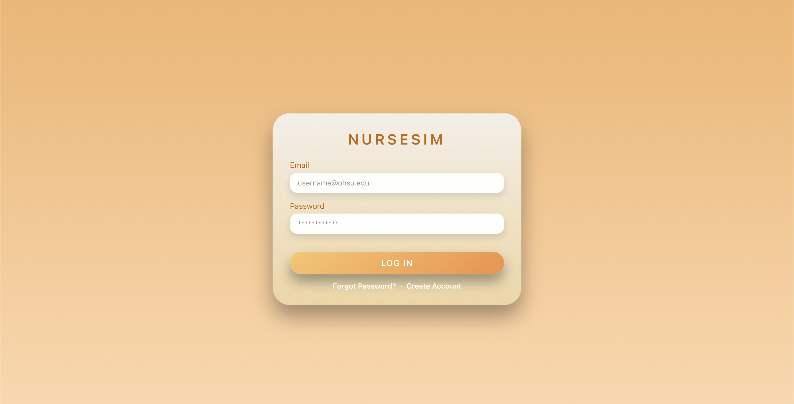
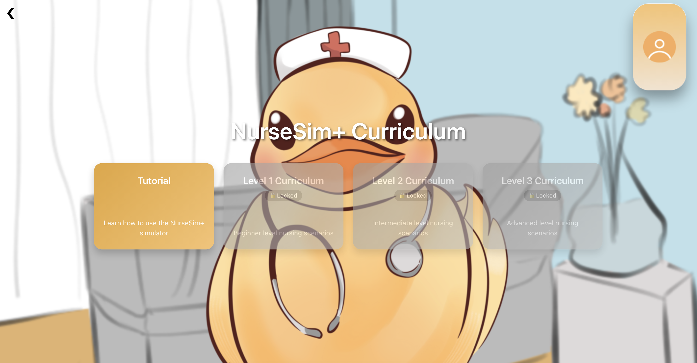
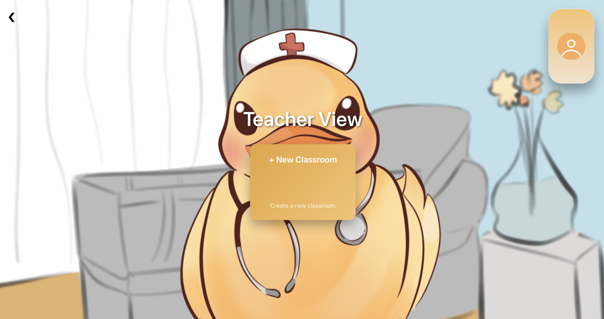

# NurseSim+
NurseSim+ is a web-based clinical simulation platform designed to expand access to flexible, interactive training for nursing students. It enables learners to practice clinical decision-making through structured, decision-based scenarios delivered entirely online.

The platform primarily serves nursing students seeking to strengthen practical reasoning skills, while also supporting instructors with tools to assign simulations and monitor student progress. NurseSim+ does not rely on VR hardware or real patient interaction, ensuring broad accessibility through standard web browsers.


## Key Features

- Role-based dashboards (Student / Instructor)
- Decision-tree clinical simulations
- Gemini-powered dynamic scenario generation
- Classroom assignment and progress tracking
- Fully web-based (Easily Accessible to Students)


## Architecture Overview

NurseSim+ follows a client-server architecture.

- The React + TypeScript frontend communicates with a Flask REST API.
- The backend handles authentication, classroom management, simulation logic, and Gemini-powered scenario generation.
- Data persistence is managed through PostgreSQL using a relational schema for users, classrooms, simulations, and progress tracking.

  
## Tech Stack

Frontend:
- React
- TypeScript

Backend:
- Flask REST API
- SQLAlchemy ORM
- Gemini API integration

Database:
- PostgreSQL

Other:
- Node.js

## Screenshots

<table>
  <tr>
    <td></td>
    <td></td>
  </tr>
  <tr>
    <td></td>
    <td></td>
  </tr>
</table>


## 1. How to install the software

### 1.1 paste the following in the command line

```
git clone git@github.com:dalyai33/NurseSim.git
cd NurseSim
```

### 1.2 create a virtual environment
```
python -m venv nursesim
source nursesim/bin/activate # macOs or Linux
nursesim/Scripts\activate # Windows

```

### 1.3 paste the following after that

```
pip install -r requirements.txt
```

## 2. How to run the software

### 2.1 enter the API to your provider
```
echo "export GEMINI_API_KEY=YOUR_GEMINI_KEY"  >> ~/.zshrc  # can be any of the following:
```
```
source ~/.zshrc # if zsh terminal
source ~/.bashrc # if bash terminal
```

### 2.2 run the server (default port: 5000)
```
python web/backend/app.py
```


## 3. Run the Web Application

1. Navigate to the frontend directory:
```
cd web
npm run dev
```

2. Open your preferred web browser.
3. Go to:
  ```
  http://localhost:5173/
  ```
  
4. Create an Account
5. Sign In
6. Create your Classroom!

## 4. Set Up the Database
Ensure PostgreSQL and pgAdmin are installed

### 4.1 Option A (schema.dump)

1. Open **pgAdmin**

2. Create a New Server

Right Click on the Servers Icon on the Left Bar
Register -> Server

```
Name: nursesim
username: any (e.g. postgres)
Hostname: localhost
Port: 5432
```

3. Create a Database 
Right Click on the Servers Icon on the Left Bar
Create -> Database

```
Database: nursesim
Locale Provider: icu (or libc)
```

4. Define the Environment Variables in the web directory
Create a `.env` file in the directory of the backend
copy and paste the following:
```
DB_NAME=nursesim
DB_USER=postgres
DB_PASSWORD=postgres
DB_HOST=localhost
DB_PORT=5432
```

5. Restore the SQL Schema
```
docs/db/schema.dump
```

### 4.2 Option B (schema.sql)

1. Open **pgAdmin**.
2. Connect to your local PostgreSQL server.
3. Right-click **Databases** → **Create** → **Database**.
4. Name it:
   - `nursesim`
5. Click **Save**.
6. Select the newly created `nursesim` database.
7. Click **Tools** → **Query Tool**.
8. Click the **Open File** icon (📂).
9. Select:
   - `docs/db/schema.sql`
10. Click **Execute**.

The database schema will now be created successfully.


## 5. Support & Questions

* Open a GitHub Issue.
* Contact the contributors below


## 6. Common GitHub Issues

**Permission denied (publickey)**
Your SSH key isn’t being used or isn’t recognized. Try:

```bash
eval "$(ssh-agent -s)"
ssh-add ~/.ssh/id_ed25519
ssh -T git@github.com
```

**Repository not found**
You don’t have access or used the wrong repo name. Make sure you can view it on GitHub while logged in.

**Asked for a password**
You cloned using HTTPS instead of SSH. Switch the remote URL (see step 5).

**Wrong key or path**
If your key isn’t in the default location, specify it in `~/.ssh/config`:

```
Host github.com
  HostName github.com
  User git
  IdentityFile ~/.ssh/my_custom_key
  IdentitiesOnly yes
  AddKeysToAgent yes
```

---

## Frequently Asked Questions

<details>
  <summary><strong>Is NurseSim+ an open-source Project?</strong></summary>
  <br>
  Yes! NurseSim+ is an open-source learning tool. However, it's strictly prohibited to use for commerical use.
  See the full terms in the <a href="LICENSE">LICENSE</a>.
  
</details>

<details>
  <summary><strong>Does NurseSim+ require VR hardware?</strong></summary>
  <br>
  No. The platform is fully web-based and runs in a standard browser.
</details>

<details>
  <summary><strong>Who can use this platform?</strong></summary>
  <br>
  Nursing students and instructors for educational purposes. However, NurseSim+ does not replace accredited clinical training or licensing requirements.
</details>

<details>
  <summary><strong>Is commericial use allowed?</strong></summary>
  <br>
  No. The software is licensed for non-commericial use only.
  See the full terms in the <a href="LICENSE">LICENSE</a>.
</details>


## Contributors
<a href="https://github.com/dalyai33/NurseSim/graphs/contributors">
  
</a>


## Contact

- Nadir - [GitHub](https://github.com/nisweesi) • [isweesin@oregonstate.edu](mailto:isweesin@oregonstate.edu)
- Aidan - [GitHub](https://github.com/) •
- Kiana - [GitHub](https://github.com/) •
- Francisco - [GitHub](https://github.com/) •
- Ian - [GitHub](https://github.com/) •
